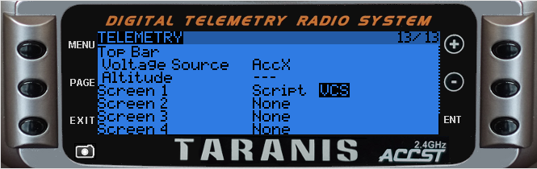
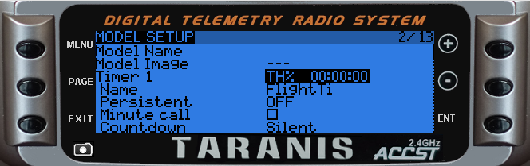
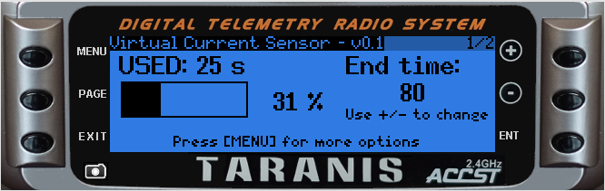
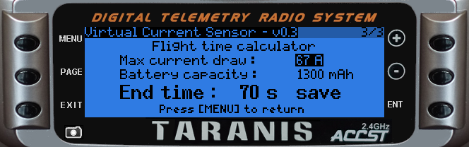
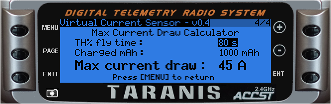
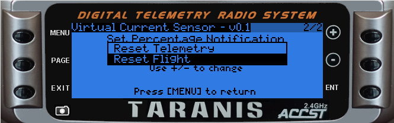

This project is a Virtual Current Sensor LUA script for the OpenTX. The script is based on using a Throttle percent timer and a re-wroten KISS telemetry script.

* This project is mainly for Quadcopters without telemetry

Usage:

* Place the VCS.lua file on the SD/SCRIPTS/TELEMETRY
* Add the script as a telemetry screen

* Enable Timer1 as a TH% 00:00:00 timer

* Open the script with a long press on PAGE from standard screen

* Change warning interval on page 2

* Calculate Flight Time on page 3

* Calculate max current draw on page 4

* Fly a battery with the TH% timer, charge it and use the values in this calculator 

The timer should be reset by using a long ENTER press and reset the flight

I did rewrite some (a lot) of the script, but all credit goes to the excellent KISS Telemetry script from DynamikAray 

( https://github.com/DynamikArray/KISS_Battery_Monitor )
