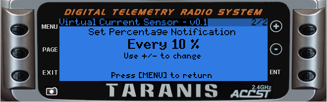

This project is a Virtual Current Sensor LUA script for the OpenTX

* This project is mainly for Quadcopters without telemetry

Usage:

* Place the VCS.lua file on the SD/SCRIPTS/TELEMETRY
* Add the script as a telemetry screen

* Enable Timer1 as a TH% 00:00:00 timer

* Open the script with a long press on PAGE from standard screen

The timer should be reset by using a long ENTER press and reset the flight

I did rewrite some of the script, but all credit goes to the excellent KISS Telemetry script from DynamikAray 

( https://github.com/DynamikArray/KISS_Battery_Monitor )
